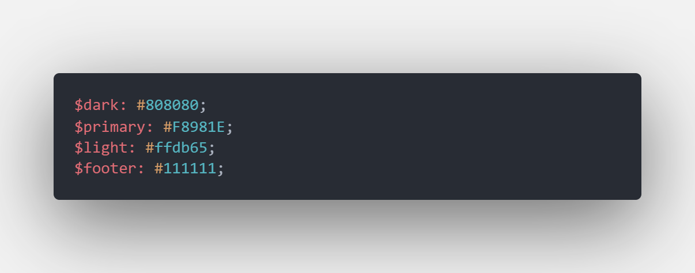
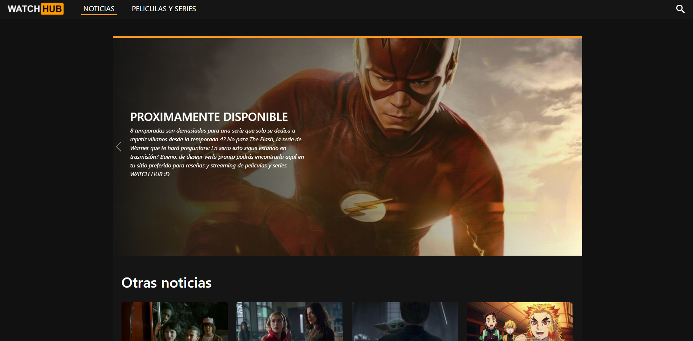
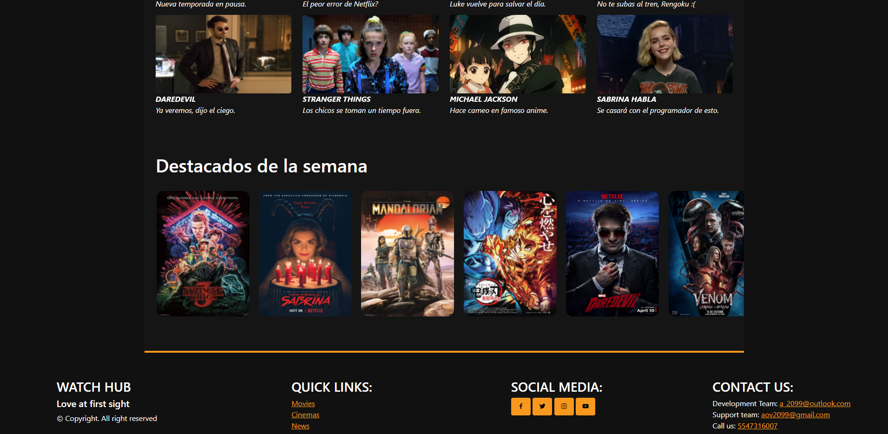
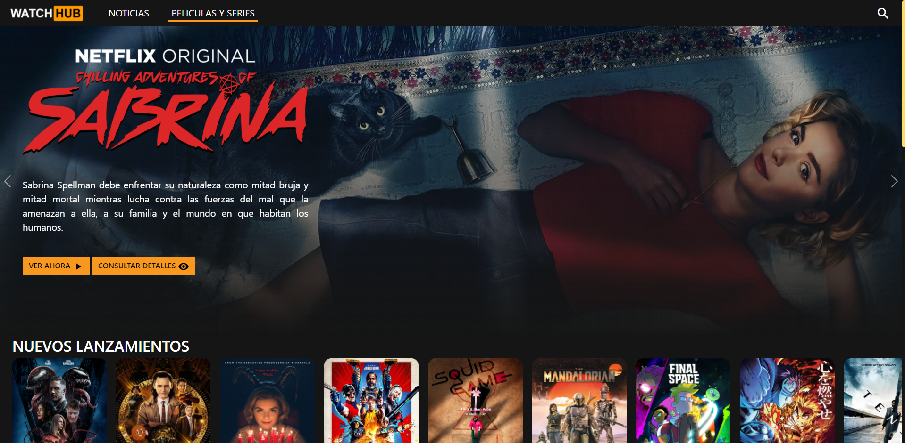
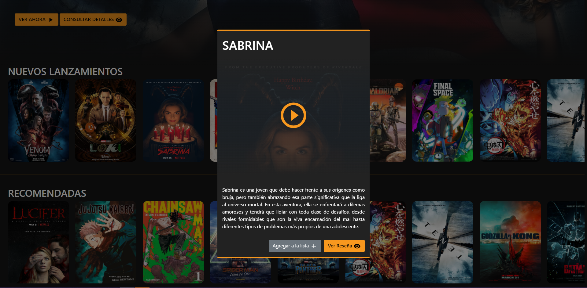
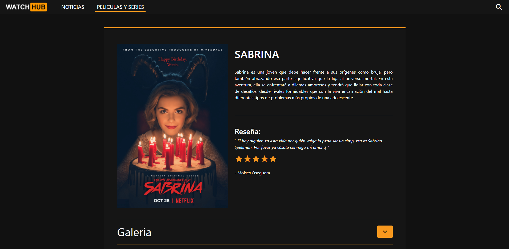
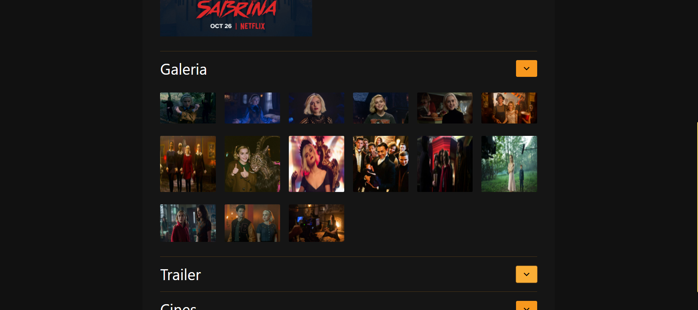
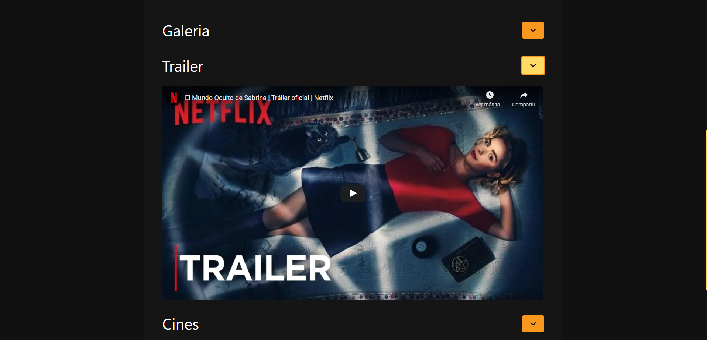
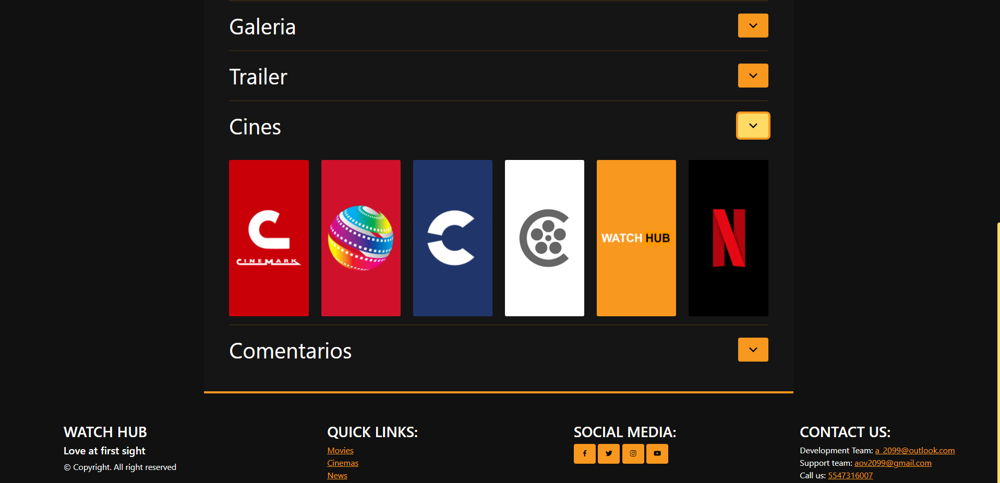
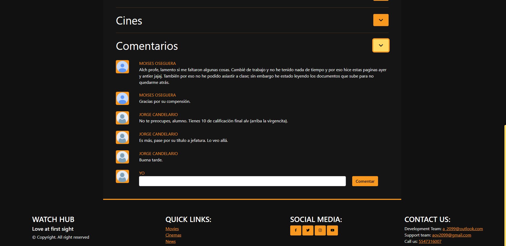

# DOCUMENTACIÓN WATCH HUB
---
> ## Descripción
Watch hub es un proyecto nacido de la necesidad de excentar una materia. Este buscabrindar a sus usarios un nuevo y único tipo de servicio, el cuál combina los servicios de las últimas noticias en el mundo de las series y pelícilas, así como brindarte el servicio de streaming a la vez.

> ## Lenguajes y librerías utlizadas
* FRONT END:
  * HTML
  * JAVASCRIPT
  * CSS
  * SCSS
  * JQUERY
  * BOOTSTRAP 5
   
* BACK END:
  * No hay, no nos dejaron.

> ## Recursos
* ### FUENTES:
  * Se utulizaron solo las predeterminadas de html para asegurar la compatibilidad.

* ### COLORES:
  * La paleta de colores utiizada es la siguiente:
  
  
* ### IMAGENES:
  * Se encuentran dentro de la dirección 'raíz/assets/img/' y se dividen en:
    *  **cinemas**: Contienen los logos de los cines disponibles.
    *  **featured**: Contienen las portadas de las recomendaciones.
    *  **gallery**: Contiene galerías de las películas.
    *  **logos**: Contiene los logos de WATCH HUB.
    *  **news**: Contiene las portadas de la sección de noticias.
    *  **posters**: Contiene el poester preview de las películas y series.
    *  **users**: Contiene las imagenes de perfil de los usuarios.
  
   * Estos recursos son nombrados con base en el Id de la película o serie a la que corresponden.
 
 * ### SCRIPTS
    * Los scrips utulizados se encuentran dentro de la carpeta 'raiz/js/' y su función es la siguiente:
      * **controller.js**: controla las funciones dentro del html "movies". 
      * **controllerNews.js**: controla las funciones dentro del html "index". 
      * **controllerRes.js**: controla las funciones dentro del html "reviews". 
      * **jquery.js**: contiene la librería jquery.
  
  * ### MODELO:
    * Al no contar con un backend no se puede conectar con una base de datos, por lo cual se simula en un JSON para su posterior consulta por los scripts. Este JSON se encuentra en 'raíz/model/data.js'

 * ### ESTILOS
    * Encontrados en 'raiz/css/' fueron escritos incialmente en sass (scss) y compilados para volverse un archivo css común, el cual importamos en todos nuestros index.
  
> ## Paginación
La página cuenta con 3 vistas diferentes, las cuales son:
* index.html
* movies.html
* review.html

A continuación se presentarán las vistas actuales de dichos archivos.

### Index
  

  

---
### Movies

---
### Review
Los botones de 'consultar detalle' o 'ver reseña' redirigen a esta vista.

En esta parte podemos ver una breve sinopsis y reseña.

Aquí se puede observar la galería de escenas.

También contamos con el trailer correspondiente.

Aquí se observan los cines en los que podemos encontrar este contenido.

Por último vemos la sección de comentarios de los usuarios, correspondienes a la serie o película.

---
> ### Notas:
* Solo las pelúclas o series que se encuntran en las sección de featured (Sabrina, Daredevil, Kimetsu no Yaiba, Stranger Things, The Mandalorian) de la página de movies cuentan con una galería completa. Esto con el fin de no saturar los assets.

